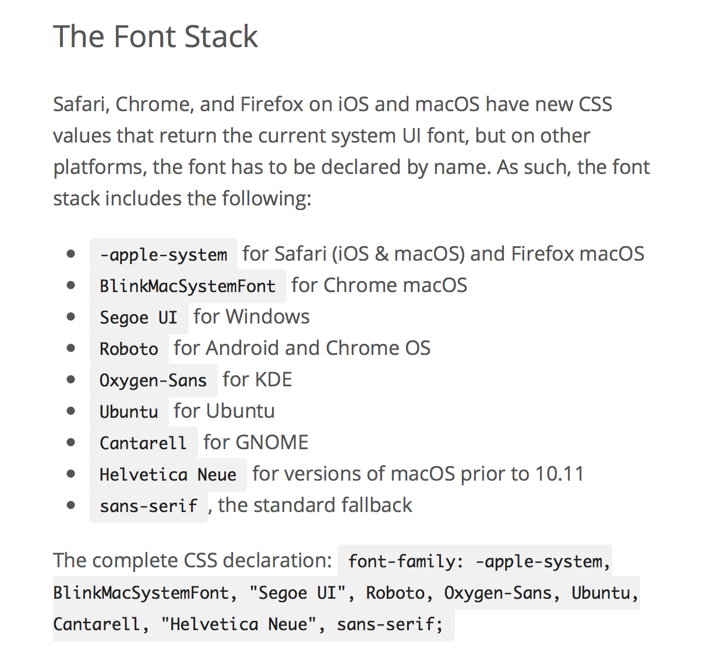

## CSS3 et Webfonts

Depuis les débuts du web, la palette typographique à disposition des designers était limitée à une poignée de fontes (
<span style="font-family: Arial">Arial</span>, 
<span style="font-family: Verdana">Verdana</span>, 
<span style="font-family: Georgia">Georgia</span>, 
<span style="font-family: Times">Times</span>, 
<span style="font-family: Courier">Courier</span>...), disponibles sur la grande majorité des systèmes d'exploitation.

Méthode classique: le "fontstack". 

Exemple, pour déclarer une fonte: 

```css
body {
   font-family: "HelveticaNeue-Light", "Helvetica Neue Light", "Helvetica Neue", 
   Helvetica, Arial, "Lucida Grande", sans-serif; 
   font-weight: 300;
}
```

Entre 2008 et 2010, tous les navigateurs ont implémenté le **CSS3 Fonts Module**, permettant de charger des fontes spécifiées par les styles CSS avec la propriété *@font-face*.


### @Fontface

La syntaxe @font-face fonctionne de la manière suivante:

```css
@font-face {
  font-family: 'Univers';
  src: url(univers-regular.woff);
}
```

Cette déclaration permet de charger la fonte, il faut ensuite l'appliquer. Par exemple comme ceci:

```css
body {
  font-family: 'Univers', sans-serif;
}
```

#### Familles de fontes

Quand on souhaite utiliser plusieurs variantes – par exemple Univers en *55 Roman*, *55 Italic* et *65 Bold* – on peut les déclarer comme une même famille:

```css
@font-face {
  font-family: 'Univers';
  src: url(univers-55-roman.woff);
  font-weight: normal;
}

@font-face {
  font-family: 'Univers';
  src: url(univers-55-italic.woff);
  font-style: italic;
}

@font-face {
  font-family: 'Univers';
  src: url(univers-65-bold.woff);
  font-weight: bold;
}
```

Il suffit ensuite d'appliquer `font-family: "Univers"` et la fonte sera correctement appliquée (avec la variante italic ou bold dans les cas nécessaires).

#### Charger plusieurs formats

Un problème rencontré lors de l'utilisation de webfonts est que les divers navigateurs utilisent des formats de fontes différents.

Voici une liste de formats courants pour le web:

- **woff** : format compressé, conçu pour le web
- **woff2** : format compressé, amélioration du format WOFF

Le format WOFF est un format développé pour le web. Il s'agit de fichiers OTF compressés afin de charger plus rapidement.

Le support des navigateurs pour les formats woff et woff2 ayant fait des progrès, [le site css-tricks](https://css-tricks.com/snippets/css/using-font-face/) propose en 2022 d'utiliser la syntaxe suivante:

```css
@font-face {
  font-family: 'MyWebFont';
  src: url('myfont.woff2') format('woff2'),
       url('myfont.woff') format('woff');
}
```

La même syntaxe [est préconisée par Bram Stein](http://alistapart.com/article/using-webfonts) sur A List Apart en 2017.

Dans la période intiale des webfonts, entre 2011 - 2016, des syntaxes plus compliquées étaient utilisées, ajoutant d'autres formats comme SVG (pour appareils iOS), EOT (pour Internet Explorer) et TTF. Ces formats ne sont désormais plus nécessaires.

Formats non-optimisés pour le web:
- **ttf** : True Type Font, format aussi utilisé pour l'impression
- **otf** : Open Type Font, format aussi utilisé pour l'impression
- **eot** : format compressé utilisé par Microsoft (Internet Explorer)

### Retour à un Font-Stack minimal

En 2016, les développeurs de WordPress décident de retourner à un "font-stack" minimal, faisant appel aux fontes système (plutôt que de charger Open Sans via Google Fonts). 



Le code du font stack: 

```css
font-family: -apple-system, BlinkMacSystemFont, 
"Segoe UI", Roboto, Oxygen-Sans, Ubuntu, 
Cantarell, "Helvetica Neue", sans-serif;
```

Ce font stack vise à utiliser les fontes d'interface natives des différents systèmes (Android, iOS, Windows, macOS, Linux).

Lire cet article pour plus de détails: [Native Fonts in 4.6](https://make.wordpress.org/core/2016/07/07/native-fonts-in-4-6/)

### Kerning, ligatures, etc

Pour savoir comment utiliser les propriétés typographiques avancées sur le web, voir cet excellent guide de Grilli Type:

[https://github.com/grillitype/web-fonts-guide](https://github.com/grillitype/web-fonts-guide)

