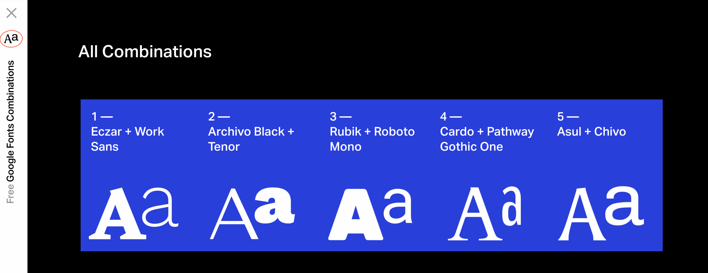
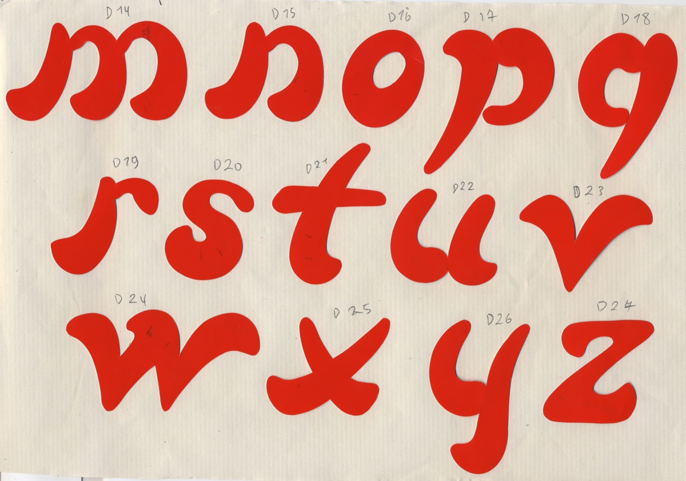
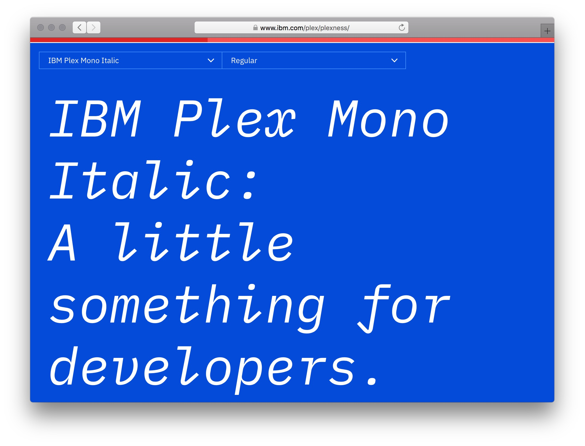
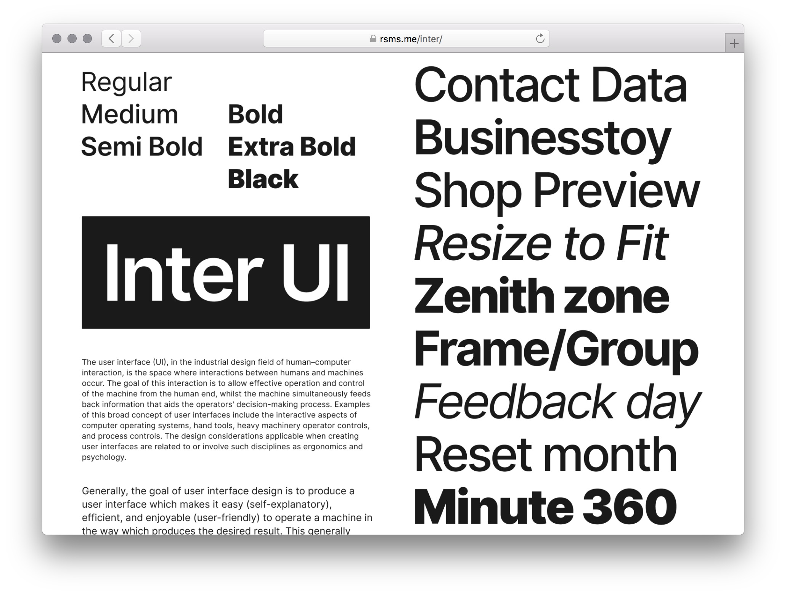
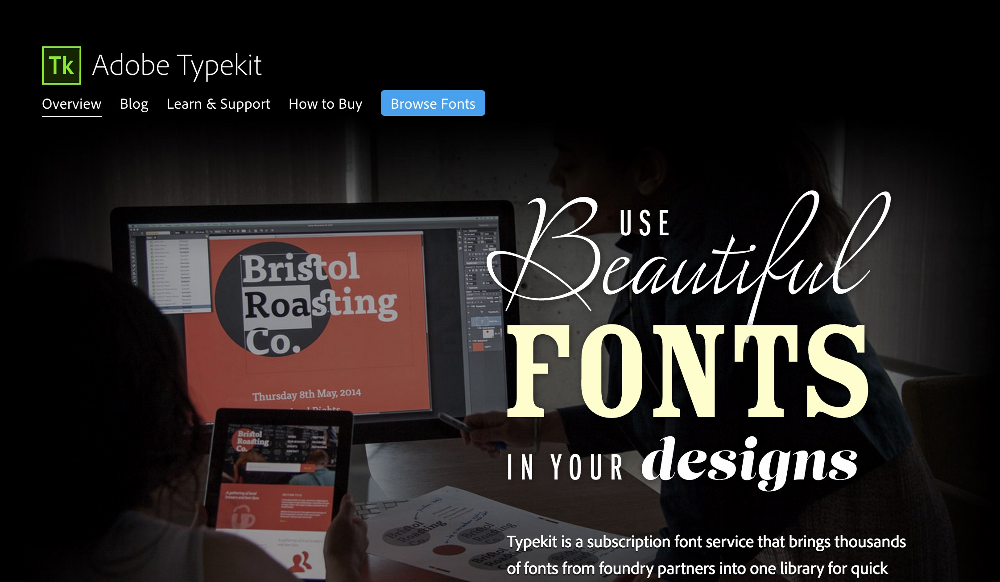
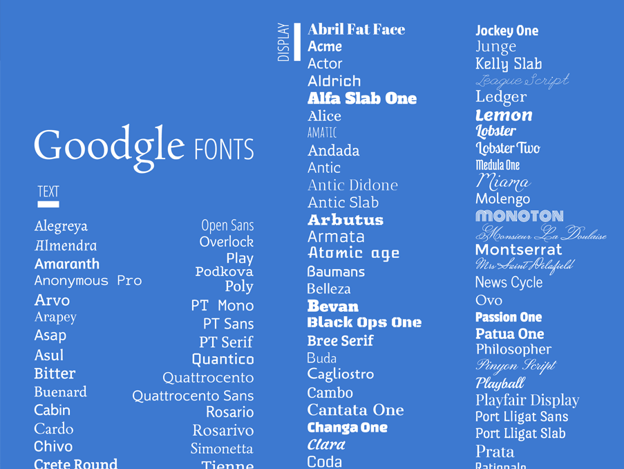

## Fontes sous licence libre

Quelques fontes typographiques intéressantes, en majeure partie sous licence libre et/ou gratuites.

## Bibliothèques de fontes:

Google Fonts:   
[https://fonts.google.com/](https://fonts.google.com)

Open Font Library:  
[https://fontlibrary.org](https://fontlibrary.org)

#### Sélections de fontes libres

Les [Fontes typo IMD](https://code.eracom-pedagogique.ch/fontes-imd/), une sélection de fontes libres recommandées, pour la filière Interactive Media Designer à l'Eracom.

Les "Hot 30", une sélection de 30 fontes libres, projet de Stefan Endress et Alastair O’Shea:  
[http://www.open-foundry.com/hot30](http://www.open-foundry.com/hot30)

Use & Modify, sélection de fontes maintenue par Raphaël Bastide:  
[http://usemodify.com/](http://usemodify.com/)

[fonts.greatsimple.io](http://fonts.greatsimple.io/), cinq belles combinaisons de fontes, par Great Simple Studio.

#### Sélections de webfonts commerciales

- [Article de Jeremiah Shoaf](http://alistapart.com/article/the-rich-typefaces-get-richer), sur la popularité des fontes.
- [Une sélection](http://kupferschrift.de/cms/2016/05/so-many-good-webfonts/) de belles fontes trop rarement utilisées, par Indra Kupferschmid.

### Fonderies typographiques

Les fontes du collectif Velvetyne Type Foundry:  
[https://velvetyne.fr/](https://velvetyne.fr/)  
Lack, Avara, Sporting Grotesque, Steps Mono...

Les fontes du collectif OSP (Open Source Publishing):   
[http://osp.kitchen/foundry/](http://osp.kitchen/foundry/)   
Limousine, Le Patin Helvète, Crickx...

### Quelques fontes open source à connaître

**IBM Plex**, par IBM   
Fonte en trois variantes, Serif, Sans-Serif et Monospaced.   
[https://www.ibm.com/plex/](https://www.ibm.com/plex/)

**Inter UI**, par Rasmus Andersson   
[https://rsms.me/inter/](https://rsms.me/inter/)

**Infini**, une fonte de Sandrine Nugue:  
[https://www.cnap.fr/sites/infini/](https://www.cnap.fr/sites/infini/)  

**Fraunces**, une fonte de Phaedra Charles:  
[https://fraunces.undercase.xyz/](https://fraunces.undercase.xyz/)

**Shantell Sans**, une alternative à Comic Sans, par Shantell Martin
[https://material.io/blog/shantell-martin-variable-font](https://material.io/blog/shantell-martin-variable-font)

**Space Grotesk**, une fonte de Florian Karsten, basée sur Space Mono
[https://floriankarsten.github.io/space-grotesk/](https://floriankarsten.github.io/space-grotesk/)

## Services de webfonts sous license

Depuis 2009, plusieurs services de vente de fontes, par formule d'abonnement, ou par achat unique, sont apparus sur le web.

Ces services ont l'avantage de proposer un grand choix de fontes, provenant de fonderies avec lesquelles ces plateformes collaborent. Voici quelques services:

* [Adobe Fonts](https://fonts.adobe.com/) - anciennement Typekit, l'un des premiers services webfont, par abonnement, acquis par Adobe en 2011.
* [Fontspring](https://www.fontspring.com/) - plateforme lancée par Ethan Dunham, créateur de [Fontsquirrel](https://www.fontsquirrel.com/).
* [Type Network](https://typenetwork.com/) - propose un catalogue fourni par 60 fonderies, notamment Font Bureau.
* [Hoefler&Co](https://www.typography.com/), service exclusif pour utiliser les fontes de Hoefler&Co.
* [Fonts.com](https://www.fonts.com/), un service appartenant à Monotype (compagnie fondée en 1887). Propose un catalogue de 20'000 fontes.
* [MyFonts](https://www.myfonts.com/), un service appartenant aussi à Monotype, proposant plus de 130'000 fontes.

## Google Fonts

Depuis 2010, Google Fonts est un service d'hébergement gratuit de fontes pour le Web. Ces polices sont sous licences libres. Ceci nous permet d'inclure très rapidement une police dans le code. De plus, les fontes sont rangées par classifications. Elles sont affichées avec un lien de téléchargement, ce qui permet de les obtenir dans plusieurs formats tels que TrueType ou OpenType.

Le projet est piloté depuis ses débuts par Dave Crossland, un alumni du master de design typogaphique de l'université de Reading, Angleterre.

## Combiner des fontes

Il peut être intéressant de combiner deux fontes pour un effet de contraste, entre la fonte choisie pour le corps de texte, et celle des titres.

Quelques ressources:

* [Google Fonts Combinations](https://www.typewolf.com/blog/google-fonts-combinations), par Jeremiah Shoaf.
* [The Step-by-Step Guide for Pairing Fonts](https://learnui.design/blog/guide-pairing-fonts.html), par Erik D. Kennedy

