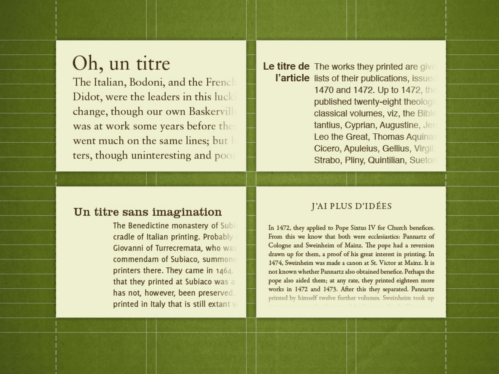

Le CSS propose des réglages typographiques concernant les lignes [veuves et orphelines](https://fr.wikipedia.org/wiki/Veuves_et_orphelines).

Ces propriétés CSS permettent d'éviter des lignes isolées (avant ou après un saut de colonne) en indiquant un nombre de lignes consécutives minimum:

```css
.colonne p {
   orphans: 3; /* min 3 lignes en bas de colonne */
   widows: 2; /* min 3 lignes en haut de colonne */
}
```

Ces règles peuvent aussi être utilisées pour les sauts des pages, dans les styles destinés à l'impression.

Actuellement (janvier 2017), ces propriétés ne sont pas prises en compte dans Firefox: [http://caniuse.com/#feat=css-widows-orphans](http://caniuse.com/#feat=css-widows-orphans) - voir le [ticket de bug](https://bugzilla.mozilla.org/show_bug.cgi?id=137367) ouvert en 2002.

### Veuves & orphelines à l'échelle d'un mot

On peut vouloir éviter les veuves et orphelins au niveau du mot, pas de la ligne. Dans ces cas-là, nous n'avons pas de propriété CSS à disposition, mais il est assez facile au moyen du JavaScript de séparer les derniers mots d'un paragraphe par des espaces insécables (`&nbsp;`).

Voici quelques solutions en JavaScript utilisant cette méthode:

[A jQuery “widon’t” snippet](http://justinhileman.info/article/a-jquery-widont-snippet/), par Justin Hileman, 2008

Le code:

```js
jQuery(function($) {
    $('h1,h2,h3,li,p').each(function() {
        $(this).html($(this).html().replace(/\s([^\s<]{0,10})\s*$/,'&nbsp;$1'));
    });
});
```

Une autre variante: [jQWidon’t](http://davecardwell.co.uk/javascript/jquery/plugins/jquery-widont/), par Dave Cardwell, 2006 

Il existe aussi un plugin WordPress, [Widon't Part Deux](https://wordpress.org/plugins-wp/widont-part-deux/), basé sur une solution en PHP proposée par le designer de jeux [Shaun Inman](http://www.shauninman.com/archive/2008/08/25/widont_2_1_1).

## Macrotypographie du web



Exemples de styles appliqués aux titres, tirés de la conférence *[La macrotypographie de la page Web ](http://www.dailymotion.com/video/xfpf08_la-macrotypographie-de-la-page-web-anne-sophie-fradier_tech)*, par Anne-Sophie Fradier (Paris Web, 2010).
