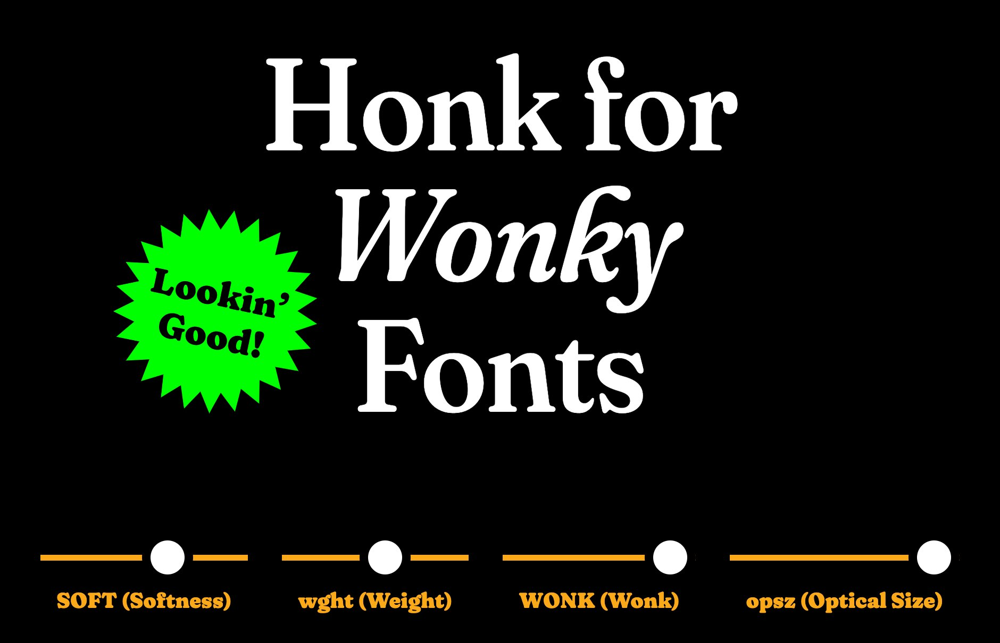
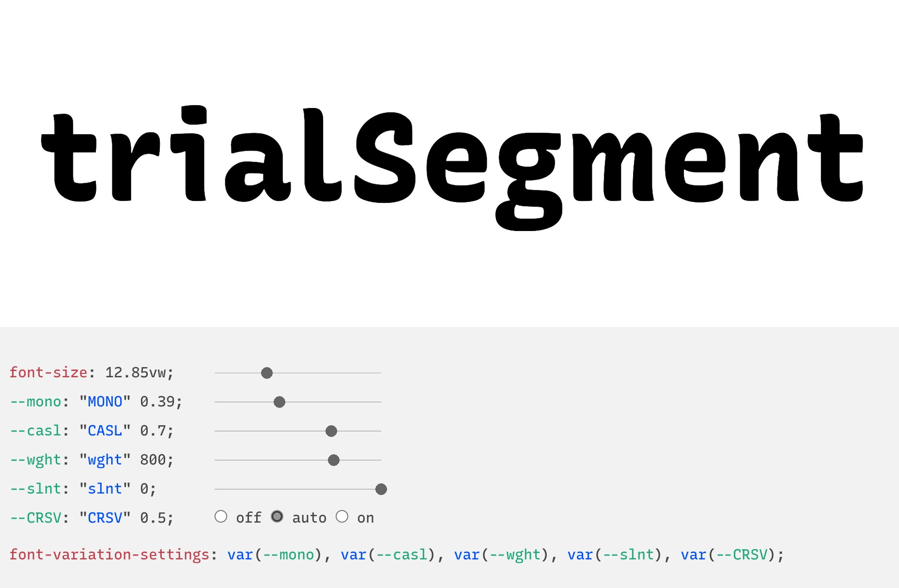

En 2016, la nouvelle spécification OpenType, présentée par Microsoft, Apple, Adobe et Google, a introduit une nouvelle technologie: les "variable fonts".

> La version 1.8 de la spécification du format OpenType introduit une nouvelle technologie qui affecte quasiment tous les aspects de ce format. Dans une fonte variable OpenType, de nombreuses fontes individuelles peuvent être combinées en un fichier unique. Cela est possible en définissant les variations de la fonte, située dans un espace à un ou plusiers axes, tout au long desquels de nombreuses instances peuvent être interpolées.

- [*Introducing OpenType Variable Fonts*](https://medium.com/variable-fonts/https-medium-com-tiro-introducing-opentype-variable-fonts-12ba6cd2369), par John Hudson, 2016



## Les axes des fontes variables

### Les cinq axes standard

Les variations des fontes variables opèrent dans des espaces nommés "axes". La spécification OpenType a défini cinq axes standard (*registered axes*) pouvant être utilisés:

- **Weight `<wght>`** : C'est la "graisse" de la fonte. Elle permet d'ajuster le style en passant du fin au gras, en variant l'épasseur des traits, l'espacement, le kerning, et d'autres aspects de la fonte. La norme: une valeur de 100 est très légère (*thin*), 400 correspond au "*regular*", et 800 est un *extra-bold*.
- **Width `<wdth>`** : "Adjust the style from narrower to wider, by varying the proportions of counters, strokes, spacing and kerning, and other aspects of the type. This typically changes the typographic color in a subtle way, and so may be used in conjunction with Width and Grade axes." Norme: 100 est la largeur normale, 200 une largeur double, 50 une demi-largeur.
- **Italic `<ital>`** : "Adjust the style from roman to italic. This can be provided as a continuous range within a single font file, like most axes, or as a toggle between two roman and italic files that form a family as a pair." Norme: "0 means roman letters and 1 means italic forms".
- **Slant `<slnt>`** : "Adjust the style from upright to slanted, also known to typographers as an 'oblique' style." Norme: "the value sets the slant angle in degrees".
- **Optical size `<opsz>`** : "Adapt the style to specific text sizes. At smaller sizes, letters typically become optimized for more legibility. At larger sizes, optimized for headlines, with more extreme weights and widths." Norme: "the value sets a point size that the design can respond to".

Ce sont les cinq axes définis dans la spécification OpenType. Selon TypeNetwork: "No other registered axes exists, i.e. axes definitions written into the specification of Opentype 1.8, but variable fonts can contain numerous  custom (unregistered) axes, for variation of styles that are new or unfamiliar to users."

### Les axes "custom"

[Dave Crossland](https://design.google/library/variable-fonts-are-here-to-stay/) (Google Fonts) donne quelques exemples : "A font can have its own axes beyond those 5 to customize any other elements, like x-height, serif style, stroke contrast, and vertical alignment."

Exemples d'axes originaux:

- La fonte **Recursive**, comporte un axe "Casual" (CASL). "Recursive uses its Casual axis to offer a range of personality, allowing you to get just the right tone for any context ... from a sturdy, rational Linear to a friendly, energetic Casual". Voir [Recursive](https://www.recursive.design/).
- La fonte **Fraunces**, comporte un axe "Wonky" (WONK). "The Wonk axis controls the substitution of “wonky” characters". Voir [Fraunces](https://fraunces.undercase.xyz/).



### La propriété Optical Size

La propriété "Optical Size" (taille optique) est une fonctionnalité très utile des fontes variables, qui permet d'améliorer la lisibilité du texte.

Le principe de la "taille optique" consiste à modifier les détails de la lettre, en fonction de la taille d'affichage. Cela existait déjà à l'époque de la typographie en plomb.

L'image ci-dessous montre les différentes tailles (de 72pts à 4pts) d'une fonte créée en 1894 (*Century Expanded*). Les petites tailles (à droite) ont été agrandies pour mieux les comparer.


Ajourd'hui, dans les fontes numériques, cette valeur est pensée pour correspondre à une taille de fontes en pixels, et garantir la meilleure lisibilité. Selon les fontes, les valeurs peuvent aller de 7 à 72 (pour *Literata*), ou de 8 à 144 (pour *Roboto Flex*). 

Selon [Dave Crossland](https://design.google/library/variable-fonts-are-here-to-stay/) : "This tells browsers to control the optical size axis automatically — styles for headings, paragraphs, and captions all perfectly tuned, all from the same font."

Quand une fonte variable possède un axe "opsz", l'ajustement de sa valeur est automatique (s'adaptant à la taille de la fonte). Sinon, on serait obligé de modifier cette valeur à chaque changement de taille, ce qui serait peu pratique!

La propriété CSS `font-optical-sizing` possède seulement deux options: 

- `auto`. C'est le réglage par défaut, il n'est donc pas nécessaire de le spécifier. L'aspect va s'adapter automatiquement selon la taille de la fonte. 
- `none`. Désactive cette fonctionnalité.

Une troisième possibilité: définir un chiffre fixe, via la propriété `font-variation-settings`. Cela permet de "forcer" une taille optique précise, différente de celle choisie automatiquement.

Voici un exemple qui force l'affichage prévu pour une taille de 8 points, quelle que soit la taille du texte :

```css
h1 {
  font-size: 3rem;
  font-variation-settings: "opsz" 8;
}
```

### La propriété CSS font-variation-settings

La [spécification CSS](https://drafts.csswg.org/css-fonts-4/#font-variation-settings-def) indique: 

> Cette propriété permet un contrôle de bas niveau sur des variations OpenType ou TrueType. Elle est prévue pour accéder à des variations rarement utilisées, pour des cas d'usage précis.

Exemple (un cas extrême avec la fonte [Decovar](https://v-fonts.com/fonts/decovar), qui possède 15 axes variables): 

```css
h1 {
  font-variation-settings: "BLDA" 0, "BLDB" 0, "SKLA" 0, "SKLB" 0, "SKLD" 0, "TRMA" 0, "TRMB" 973, "TRMC" 0, "TRMD" 0, "TRME" 0, "TRMF" 0, "TRMG" 0, "TRMK" 0, "TRML" 0, "WMX2" 12, "opsz" 102;
}
```

Précisions de la spécification:

> When possible, authors should generally use the other properties related to font variations (such as `font-optical-sizing`), and only use this property for special cases where its use is the only way of accessing a particular infrequently used font variation.
>
> For example, it is preferable to use `font-weight: 700` rather than `font-variation-settings: "wght" 700`.


## Charger une Variable Font depuis Google Fonts

Explications sur les URL Google Fonts: 

[https://developers.google.com/fonts/docs/css2#forming_api_urls](https://developers.google.com/fonts/docs/css2#forming_api_urls)

Quelques explications sont données dans cette vidéo (Debug TV, épisode 1): 

<iframe width="100%" style="aspect-ratio: 16 / 9;" src="https://www.youtube.com/embed/E9OkJLFqZks" title="YouTube video player" frameborder="0" allow="accelerometer; autoplay; clipboard-write; encrypted-media; gyroscope; picture-in-picture" allowfullscreen></iframe>


## Codepens de démonstration:

"Recursive Mono &amp; Sans, all axes from Google Fonts API", un codepen par Dave Crossland (Google Fonts):

<p class="codepen" data-height="300" data-default-tab="css,result" data-slug-hash="eYRJeqp" data-user="davelab6" style="height: 300px; box-sizing: border-box; display: flex; align-items: center; justify-content: center; border: 2px solid; margin: 1em 0; padding: 1em;">
  <span>See the Pen <a href="https://codepen.io/davelab6/pen/eYRJeqp">
  Recursive Mono &amp; Sans, all axes from Google Fonts API</a> by Dave Crossland (<a href="https://codepen.io/davelab6">@davelab6</a>)
  on <a href="https://codepen.io">CodePen</a>.</span>
</p>

---

"Simple weight slider for Hepta Slab", par Laurence Penney :

<p class="codepen" data-height="300" data-default-tab="result" data-slug-hash="ZEbqGYG" data-user="lorp" style="height: 300px; box-sizing: border-box; display: flex; align-items: center; justify-content: center; border: 2px solid; margin: 1em 0; padding: 1em;">
  <span>See the Pen <a href="https://codepen.io/lorp/pen/ZEbqGYG">
  Simple weight slider for Hepta Slab</a> by Laurence Penney (<a href="https://codepen.io/lorp">@lorp</a>)
  on <a href="https://codepen.io">CodePen</a>.</span>
</p>

---

"Optical size for CSS authors", par Laurence Penney

<p class="codepen" data-height="300" data-default-tab="result" data-slug-hash="GXQmmZ" data-user="lorp" style="height: 300px; box-sizing: border-box; display: flex; align-items: center; justify-content: center; border: 2px solid; margin: 1em 0; padding: 1em;">
  <span>See the Pen <a href="https://codepen.io/lorp/pen/GXQmmZ">
  Optical size for CSS authors</a> by Laurence Penney (<a href="https://codepen.io/lorp">@lorp</a>)
  on <a href="https://codepen.io">CodePen</a>.</span>
</p>

---

Une animation d'une Variable Font, en simple CSS:

<p class="codepen" data-height="300" data-default-tab="css,result" data-slug-hash="wvjKVem" data-user="eracom" style="height: 300px; box-sizing: border-box; display: flex; align-items: center; justify-content: center; border: 2px solid; margin: 1em 0; padding: 1em;">
  <span>See the Pen <a href="https://codepen.io/eracom/pen/wvjKVem">
  Variable font animation (Roboto)</a> by Manuel Schmalstieg (<a href="https://codepen.io/eracom">@eracom</a>)
  on <a href="https://codepen.io">CodePen</a>.</span>
</p>

---

"Hepta Slab Wave Animation", par Dave Crossland:

<p class="codepen" data-height="300" data-default-tab="result" data-slug-hash="QWEJpWa" data-user="davelab6" style="height: 300px; box-sizing: border-box; display: flex; align-items: center; justify-content: center; border: 2px solid; margin: 1em 0; padding: 1em;">
  <span>See the Pen <a href="https://codepen.io/davelab6/pen/QWEJpWa">
  Hepta Slab Wave Animation</a> by Dave Crossland (<a href="https://codepen.io/davelab6">@davelab6</a>)
  on <a href="https://codepen.io">CodePen</a>.</span>
</p>

---

## Références

* [https://variablefonts.io/](https://variablefonts.io/) - A Variable Fonts Primer
* [https://www.axis-praxis.org/](https://www.axis-praxis.org/)
* [https://variablefonts.typenetwork.com/](https://variablefonts.typenetwork.com/)
* [https://web.dev/variable-fonts/](https://web.dev/variable-fonts/)
* [Variable Fonts Are Here to Stay](https://design.google/library/variable-fonts-are-here-to-stay/), By Dave Crossland and Laurence Penney (Google Design)

### Listes de fontes

* [https://v-fonts.com/](https://v-fonts.com/) : un site listant des Variable Fonts disponibles.
* [Google Fonts catalog](https://fonts.google.com/?vfonly=true) (filter: variable fonts)
*  [Google Fonts axes values table](https://fonts.google.com/variablefonts) : liste des fontes variables sur Google Fonts, avec leurs paramètres (axes).

### Outils web pour inspecter des Variable Fonts

* [https://wakamaifondue.com/](https://wakamaifondue.com/) : outil web pour inspecter une fonte variable.
* [Samsa](https://lorp.github.io/samsa/src/samsa-gui.html) :  interactively visualizes the mechanics of variable fonts in innovative ways

### La spécification CSS actuelle, CSS Fonts Module Level 4

* Sur le site CSS Working Group: [https://drafts.csswg.org/css-fonts-4/](https://drafts.csswg.org/css-fonts-4/)

### Belles pages de démonstration de fontes variables

- [Piazzolla](https://piazzolla.huertatipografica.com/)
- [Fraunces](https://fraunces.undercase.xyz/)
- [Recursive](https://www.recursive.design/)

## Autres références

Long article sur la perfomance des fontes variables:

[https://blog.logrocket.com/variable-fonts-is-the-performance-trade-off-worth-it/](https://blog.logrocket.com/variable-fonts-is-the-performance-trade-off-worth-it/)

